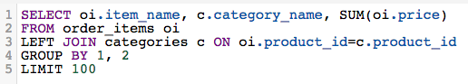

# Scegliere un generatore di report

>[!NOTE]
>>Richiede [Autorizzazioni amministratore](../../administrator/user-management/user-management.md).

A tutti piace avere delle opzioni. Ma, quando ci si confronta con delle scelte, alcuni di noi potrebbero rifiutare e congelare l&#39;idea di dover impegnarsi in una decisione. Le opzioni sono fantastiche, ma possono anche essere schiaccianti e confuse.

Ora che disponi di più opzioni per la creazione delle analisi, a volte potrebbe essere difficile sapere esattamente quale sapore del generatore di report soddisferà le tue esigenze. Se ti servono indicazioni sulla scelta del modo migliore per creare la tua analisi, questo articolo è per te.

## Quando dovrei usare il `SQL Report Builder`? {#whensql}

Dai un&#39;occhiata ad alcuni dei motivi più comuni per cui utilizzeresti il Report Builder SQL rispetto al Report Builder tradizionale.

### Se si desidera utilizzare funzioni specifiche di SQL...

Parte della bellezza del `SQL Report Builder` consente di utilizzare funzioni non attualmente disponibili in Data Warehouse Manager. In passato, un analista potrebbe aver dovuto intervenire per aiutarti a realizzare pienamente la tua visione.

Il Report Builder SQL supporta funzioni come [`LISTAGG`](https://docs.aws.amazon.com/redshift/latest/dg/r_LISTAGG.html) e [`GETDATE`](https://docs.aws.amazon.com/redshift/latest/dg/r_GETDATE.html), che non era possibile utilizzare in precedenza. Puoi accedere al [`full list`](https://docs.aws.amazon.com/redshift/latest/dg/c_SQL_functions.html), ma alcune altre funzioni specifiche di SQL includono:

* [`Bitwise aggregate` Funzioni](https://docs.aws.amazon.com/redshift/latest/dg/c_bitwise_aggregate_functions.html)
* [`CASE expression`](https://docs.aws.amazon.com/redshift/latest/dg/r_CASE_function.html)
* [`JSON_EXTRACT_PATH_TEXT`](https://docs.aws.amazon.com/redshift/latest/dg/JSON_EXTRACT_PATH_TEXT.html)
* [`LOG`](https://docs.aws.amazon.com/redshift/latest/dg/r_LOG.html)
* [`MONTHS_BETWEEN`](https://docs.aws.amazon.com/redshift/latest/dg/r_MONTHS_BETWEEN_function.html)
* [`REPLACE`](https://docs.aws.amazon.com/redshift/latest/dg/r_REPLACE.html)
* [`SQRT`](https://docs.aws.amazon.com/redshift/latest/dg/r_SQRT.html)
* [`concatenation` operatore](https://docs.aws.amazon.com/redshift/latest/dg/r_concat_op.html)

### Se vuoi fare dei test...

Se desideri provare diverse tecniche e strategie per capire cosa funziona meglio per l’analisi, puoi utilizzare la funzione `SQL Report Builder`. La creazione di colonne in Data Warehouse Manager richiede tempo e le colonne create con DWM dipendono dai cicli di aggiornamento.

Al massimo, è necessario attendere un ciclo di aggiornamento prima di poter utilizzare la colonna. Se ti rendi conto di aver commesso un errore nella costruzione della colonna, dovrai aspettare attraverso *due* cicli: uno per compilare inizialmente la colonna e un altro ciclo per le revisioni da propagare.

### Se si utilizza una nuova colonna solo una volta...

Come accennato nella sezione precedente, la creazione di una nuova colonna in Data Warehouse Manager richiede tempo. Se prevedi di utilizzare solo una colonna creata in un rapporto, ti consigliamo di utilizzare il `SQL Report Builder`. In questo modo si elimina la necessità di attendere il completamento di un ciclo di aggiornamento, per tornare a lavorare più rapidamente.

### Se lavori con dati che hanno una relazione uno-a-molti...

In alcuni casi, la struttura dei dati potrebbe rendere il `SQL Report Builder` una scelta più efficiente e logica per generare le analisi. Creare colonne per relazioni uno-a-uno è abbastanza semplice in Data Warehouse Manager, ma le cose possono diventare un po&#39; confuse quando si tratta di relazioni uno-a-molti.

Supponiamo che un singolo prodotto sia considerato parte di più categorie di prodotti e desideri visualizzare i ricavi associati a ciascuna categoria di ciascun prodotto. Provare a creare questa relazione utilizzando il DWM può essere noioso e difficile, ma scrivere una query SQL potrebbe essere un po&#39; più semplice:

## Quando dovrei usare il Report Builder tradizionale? {#whentraditionalrb}

Mentre il `SQL Report Builder` offre maggiore controllo e accesso alle funzionalità precedentemente non disponibili, ma potrebbe non essere sempre la scelta giusta. Si consiglia inoltre di considerare quanto segue quando si decide quale sapore del generatore di report utilizzare.

### Se stai creando un report semplice..

Se ciò che si desidera creare è semplice, l&#39;utilizzo del Report Builder tradizionale può essere molto più veloce della scrittura di una query SQL completa. Sarà utile anche se eventuali colonne necessarie per creare l’analisi sono già presenti in Data Warehouse Manager.

### Se condividi il tuo lavoro con altri utenti...

Gli utenti della tua organizzazione utilizzeranno/visualizzeranno questa analisi? A seconda di chi condividi il tuo lavoro con, in alcuni casi potrebbe essere meglio attenersi al Report Builder visivo. Gli utenti possono esaminare rapidamente la definizione nel Report Builder visivo anziché leggere una query SQL potenzialmente lunga.

Se alcune persone hanno bisogno del rapporto ma non hanno familiarità con SQL, si consiglia di utilizzare il sapore originale del Report Builder. Rende le cose più facili su di loro.

## Ritorno a capo {#wrapup}

Entrambi i `SQL Report Builder` e `Visual Report Builder` sono adatti a una vasta gamma di casi d&#39;uso. In genere questo dipende da quali sono le tue esigenze analitiche e da chi utilizzerà l’analisi.
