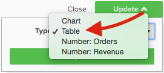

# Opzioni di visualizzazione

La selezione della visualizzazione corretta per un dato set di dati è un elemento critico del processo di analisi. Ogni set di dati ha una storia da raccontare, ma l&#39;effetto di quella storia è enfatizzato dal suo impatto visivo e dalla sua leggibilità.

La [!DNL MBI] `Visual Report Builder` offre 12 opzioni di visualizzazione distinte, ciascuna con i propri vantaggi e casi d’uso. Questo articolo illustra le varie opzioni di visualizzazione in [!DNL MBI], incluse le configurazioni richieste per i rapporti, se applicabili, nonché un esempio di caso d’uso. In MBI sono disponibili le seguenti visualizzazioni:

* `Scalar`
* `Table`
* `Line`
* `Bar`
* `Stacked Bar`
* `Column`
* `Stacked Column`
* `Pie`
* `Area`
* `Funnel`
* `Scatter plot`
* `Bubble`
* `Heatmap`

## `Scalar`

`Scalar` i rapporti sono visualizzati come un singolo valore numerico. Nella maggior parte dei casi questo viene utilizzato per mostrare il valore &quot;all time&quot; di una metrica chiave come ricavi o ordini, o per confrontare le entrate con data e budget con due rapporti scalari separati. Nell’esempio seguente, questo mostra semplicemente il numero totale di ordini per un dato intervallo di reporting:

Per salvare un rapporto in scala, configura i filtri e le impostazioni di ora, quindi fai clic su **[!UICONTROL Save]** o **[!UICONTROL Update]** in alto a destra nel rapporto. Sotto la `Type` a discesa, scegli il Numero: Nome della metrica per salvare il rapporto come valore visualizzato nella barra laterale sinistra.

**Requisiti**:

* `Time interval`: `None`
* `Group by`: `None`
* Solo una metrica

## `Table`

Come suggerisce il nome, `table` i rapporti sono ideali per la visualizzazione di dettagli tabulari. Quando è necessario visualizzare un numero elevato di gruppi in base a valori o metriche in un singolo rapporto, una tabella è spesso il modo migliore per procedere. Ad esempio, di seguito è riportata una tabella con i &quot;dettagli cliente&quot;, che mostra gli ordini e i ricavi raggruppati per e-mail del cliente:

Analogamente ai rapporti scalari, è possibile salvare un rapporto come tabella facendo clic su **[!UICONTROL Save]** o **[!UICONTROL Update]** in Report Builder, quindi seleziona l’opzione Tabella in `Type` a discesa.

**Requisiti:**

* Sebbene non vi siano requisiti di configurazione dei report, è importante notare che le tabelle sono limitate a 3500 righe. Se il set di dati include più di 3500 righe, dovrai filtrare i risultati per limitare l’ambito o esportare i risultati in `.csv` o `Excel` per visualizzare l&#39;intero set di dati.

## `Line`

`Line` i grafici sono la scelta perfetta per confrontare le prestazioni di coorti di metriche simili. Ad esempio, l’analisi dei ricavi di due regioni nello stesso periodo di tempo o il confronto tra la crescita annua degli ordini eseguiti, come illustrato di seguito:

Ogni metrica e formula aggiunta al rapporto è rappresentata dalla propria riga. Quando confronti metriche con unità e scale simili, non dimenticare di deselezionare la casella di controllo per `Multiple Y-Axes` per visualizzare tutte le metriche sulla stessa scala.

Per salvare un rapporto come grafico a linee, regolare il rapporto `Type` a `Chart`, quindi seleziona la visualizzazione appropriata dall’interno del generatore di report, come illustrato di seguito:

**Requisiti:**

* Nessuno

## `Bar`

`Bar` i grafici presentano i dati come una serie di barre orizzontali e sono ideali per mostrare le prestazioni complessive di un numero limitato di metriche o gruppi per valori. Ad esempio, è possibile utilizzare un grafico a barre per confrontare i ricavi per negozio:

Ogni combinazione di metrica, gruppo per e intervallo di tempo distinta viene visualizzata come una propria barra. Se hai due metriche con una `group by`, con tre distinte `group by` nel rapporto vengono visualizzate sei barre separate.

Per salvare un rapporto come grafico a barre, regolare il rapporto `Type` a `Chart` e seleziona la `Bar` come mostrato di seguito:

**Requisiti:**

* Nessuno

## `Stacked Bar`

`Stacked bar` i grafici sono simili ai loro fratelli grafici a barre, con la possibilità aggiuntiva di visualizzare la suddivisione proporzionale di ogni barra. Nella maggior parte dei casi, i grafici a barre sovrapposti sono configurati con due o più metriche e un singolo gruppo per, in modo che ogni barra rappresenti un gruppo univoco per valore suddiviso tra i componenti della metrica.

Ad esempio, il rapporto seguente ha due metriche di ricavi identiche: uno filtrato per i primi ordini e l&#39;altro filtrato per gli ordini ripetuti. Dopo il raggruppamento per archivio, puoi visualizzare sia il contributo totale dei ricavi per ogni negozio (rappresentato dalla larghezza totale della barra) sia la prima volta rispetto alla suddivisione ripetuta dei ricavi per ogni negozio:

Assicurati che `Multiple Y-Axes` deseleziona quando imposti un rapporto come sopra.

Per salvare un rapporto come grafico a barre sovrapposte, regolalo `Type` a `Chart` e seleziona l’opzione barra sovrapposta dal generatore di report:

**Requisiti:**

* Nessuno

## `Column`

`Column` i grafici rappresentano ciascun punto dati come una colonna verticale e sono generalmente migliori per la visualizzazione dei dati con tendenze temporali rispetto alla visualizzazione grafico a barre orizzontali. Poiché ogni metrica e gruppo univoco per combinazione è rappresentato nella propria serie di barre, un rapporto di colonna è generalmente il migliore per i rapporti con tre o meno metriche, o una metrica con un singolo gruppo contenente 1-3 gruppi per valori.

Nell’esempio seguente, vengono mostrate due metriche di ricavo, una filtrata per le prime entrate e l’altra per le entrate ripetute, con tendenze nel tempo per mese:

I rapporti colonna possono essere salvati modificando il rapporto `Type` a `Chart`e selezionando l’opzione di visualizzazione delle colonne:

**Requisiti:**

* Nessuno

## `Stacked Column`

`Stacked column` i rapporti sono quasi identici ai grafici a colonne, tranne per le colonne simili sovrapposte tra loro, in modo che l’altezza totale rappresenti la somma dei valori. Le colonne sovrapposte vengono nuovamente visualizzate meglio con un numero limitato di metriche o gruppi di byte.

Utilizzando la stessa configurazione di report come descritto in `Column` in precedenza, un rapporto con due metriche di ricavo (filtrate per la prima volta e ripetute) si presenta come in seguito con una visualizzazione a colonne sovrapposte:

Anche in questo caso, è importante che la `Multiple Y-Axes` deseleziona quando vengono visualizzate più metriche con la visualizzazione delle colonne sovrapposte.

Per salvare un rapporto come colonna sovrapposta, impostare il rapporto `Type` a `Chart` e seleziona la `stacked column` opzione:

**Requisiti:**

* Nessuno

## `Pie`

`Pie` i grafici sono ideali per visualizzare una singola metrica con una o più coppie di gruppi o più metriche senza coppie di gruppi. In entrambi i casi, l&#39;intervallo di tempo deve essere impostato su Nessuno per visualizzare i dati in un grafico a torta. Nell’esempio seguente, una singola metrica ordini è raggruppata per nome archivio per mostrare la suddivisione degli ordini per store:

Per salvare un rapporto come grafico a torta, impostare il rapporto `Type` a `Chart` e seleziona la `pie` come mostrato di seguito:

**Requisiti:**

* `Time interval`: `None`
* Una delle seguenti opzioni:
   * `Single metric with one or more group bys`
   * `Multiple metrics with no group bys`

## `Area`

`Area` i grafici sono quasi identici ai grafici a colonne sovrapposte, tranne per il fatto che le colonne vengono visualizzate continuamente. Simile alle colonne sovrapposte, i grafici ad area sono visualizzati meglio con un numero limitato di coppie o metriche di gruppi.

Prendendo lo stesso esempio dal `stacked column` il rapporto seguente mostra la prima volta rispetto alle entrate ripetute con la visualizzazione grafico a superfici:

Per salvare un report come grafico ad area, regolare la `Type` a `Chart` e seleziona l’opzione area:

**Requisiti:**

* Nessuno

## `Funnel`

`Funnel` I grafici sono perfetti per visualizzare la conversione in una sequenza di eventi prevista. Alcuni esempi includono l’analisi dei potenziali ricavi nel funnel di vendita da lead a Closed Dealer, o la misurazione del calo dei clienti tra il primo e il secondo ordine, il secondo e il terzo ordine e così via. Di seguito è riportato un esempio di quest’ultimo:

In un rapporto funnel, il valore relativo di un determinato passaggio dell’imbuto si riflette sull’altezza del passaggio e l’ordine in cui i passaggi vengono visualizzati è determinato dalla configurazione del rapporto. Esistono due modi per configurare un rapporto funnel:

* `Single metric with one group by`: - Ordine dei passaggi determinato dall&#39;impostazione &quot;Mostra in alto/in basso&quot; del gruppo. Per impostazione predefinita, i passaggi funnel vengono visualizzati in ordine dal valore più grande a quello più piccolo, ma è anche possibile ordinarli alfabeticamente in base al gruppo per nome.

* `Multiple metrics with no group by`: - Ordine dei passaggi determinato dall’ordine in cui le metriche vengono aggiunte al rapporto.

Per salvare un rapporto come grafico funnel, regolare il rapporto `Type` a `Chart` e seleziona la visualizzazione appropriata da Report Builder.

**Requisiti:**

* `Time interval`: `None`
* Una delle seguenti opzioni:
   * `Single metric with one group by`
   * `Multiple metrics with no group by`

## `Scatter plot`

A `scatter plot` viene utilizzato per esaminare la relazione di una metrica con due variabili diverse in modo da poter identificare facilmente correlazioni e anomalie. Si consiglia di utilizzare questo tipo di visualizzazione solo con dimensioni numeriche, utilizzando la metrica Ordini e la `Customer's lifetime number of coupons` e `Customer's lifetime revenue` dimensioni per visualizzare come l’utilizzo del coupon è correlato ai ricavi. È possibile scegliere tra un grafico a dispersione con e senza linea di tendenza:

**Requisiti:**

Opzione 1:

* Due `metrics`
* Uno `group by`
* `Time interval`: `None`

Opzione 2:

* Due `metrics`
* No `group by`
* Imposta `time interval`

## `Bubble` grafico

A `bubble` il grafico può visualizzare fino a quattro dimensioni di dati in cui `X` e `Y` gli assi specificano la posizione delle bolle, `Z` Asse è la dimensione delle bolle, e includendo due coppie di gruppi è possibile aggiungere colore alle bolle. Si consiglia di utilizzare questo tipo di visualizzazione per tracciare più dimensioni di dati in un singolo grafico.

Ad esempio, il grafico seguente mostra il numero di clienti (dimensioni bolle) raggruppati per una specifica origine di acquisizione (colore a bolle) e lo stato (varie bolle di colore specifico), tracciati in base ai ricavi totali e agli ordini della durata media.

Il grafico seguente mostra il numero di clienti (dimensioni bolle) raggruppati per origine di acquisizione (colore a bolle) e per stato (varie bolle di colore specifico), con un grafico rispetto al valore medio del ciclo di vita e al ricavo totale.

**Requisiti per i grafici a bolle a serie singola:**

Opzione 1

* Tre `metrics`
* Uno `group by`
* `Time interval`: `None`

Opzione 2

* Tre `metrics`
* No `group by`
* Imposta `time interval`

**Requisiti per i grafici a bolle a più serie:**

* Tre `metrics`
* Due `group by`
* `Time interval`: `None`

## `Heatmap`

Utilizzo `heatmaps` per visualizzare gli hot spot nei dati. Ad esempio, una mappa di calore può indicare dove si ottiene sistematicamente un volume più alto. La visualizzazione di questi dati consente di regolare i livelli di inventario per assicurarsi di soddisfare la domanda durante le finestre di picco.

La seguente mappa di calore mostra gli ordini per giorno della settimana per ora del giorno in aggregato, per diverse settimane.

<!--{: width="650"}-->

**Requisiti:**

Opzione 1

* Uno `metric`
* Due `group by`
* `Time interval`: `None`

Opzione 2

* Uno `metric`
* Uno `group by`
* Imposta `time interval`
