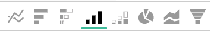

# Opzioni di visualizzazione

La selezione della visualizzazione corretta per un dato set di dati è un elemento fondamentale del processo analitico. Ogni set di dati ha una storia da raccontare, ma l&#39;effetto di quella storia è enfatizzato dal suo impatto visivo e dalla sua leggibilità.

[!DNL Commerce Intelligence] [!DNL Visual Report Builder] offre 12 opzioni di visualizzazione distinte, ciascuna con i propri vantaggi e casi d&#39;uso. In questo argomento vengono illustrate le varie opzioni di visualizzazione disponibili in [!DNL Commerce Intelligence], incluse le configurazioni di report richieste, se applicabili, e un esempio di caso d&#39;uso. In [!DNL Commerce Intelligence] sono disponibili le seguenti visualizzazioni:

* `Scalar`
* `Table`
* `Line`
* `Bar`
* `Stacked Bar`
* `Column`
* `Stacked Column`
* `Pie`
* `Area`
* `Funnel`
* `Scatter plot`
* `Bubble`
* `Heatmap`

## `Scalar`

`Scalar` report sono visualizzati come un singolo valore numerico. Nella maggior parte dei casi viene utilizzato per mostrare il valore &quot;in qualsiasi momento&quot; di una metrica chiave come ricavi o ordini, o per confrontare i ricavi attuali rispetto al budget con due rapporti scalari separati. Nell’esempio seguente, questo mostra semplicemente il numero totale di ordini per l’intervallo di reporting specificato:

Per salvare un report come scalare, configura i filtri e le impostazioni di ora, quindi fai clic su **[!UICONTROL Save]** o **[!UICONTROL Update]** nella sezione in alto a destra del report. Nel menu a discesa `Type`, scegli Numero: Nome metrica per salvare il rapporto come valore visualizzato sulla barra laterale sinistra.

**Requisiti**:

* `Time interval`: `None`
* `Group by`: `None`
* Una sola metrica

## `Table`

Come suggerisce il nome, `table` report sono ideali per la visualizzazione dei dettagli tabulari. Quando è necessario visualizzare più gruppi per valori o metriche in un singolo rapporto, spesso la tabella è la soluzione migliore. Ad esempio, di seguito è riportata una tabella di &quot;Dettagli cliente&quot; che mostra gli ordini e i ricavi raggruppati per e-mail del cliente:

Analogamente ai report scalari, è possibile salvare un report come tabella facendo clic su **[!UICONTROL Save]** o **[!UICONTROL Update]** nel generatore di report e selezionando l&#39;opzione Tabella nel menu a discesa `Type`.

**Requisiti:**

* Anche se non esistono requisiti di configurazione del rapporto, è importante notare che le tabelle sono limitate a 3500 righe. Se il set di dati include più di 3500 righe, è necessario filtrare i risultati per limitare l&#39;ambito oppure esportare i risultati in `.csv` o `Excel` per visualizzare il set di dati completo.

## `Line`

`Line` grafici sono la scelta perfetta per confrontare le prestazioni di coorti metriche simili. Ad esempio, analizzando le entrate di due aree nello stesso periodo di tempo o confrontando la crescita su base annua degli ordini evasi, come illustrato di seguito:

Ogni metrica e formula aggiunta al rapporto è rappresentata da una propria riga. Quando si confrontano metriche con unità e scale simili, non dimenticare di deselezionare la casella di controllo di `Multiple Y-Axes` per visualizzare tutte le metriche sulla stessa scala.

Per salvare un report come grafico a linee, regolare il report `Type` in `Chart` e selezionare la visualizzazione appropriata dall&#39;interno del generatore di report, come illustrato di seguito:

**Requisiti:**

* Nessuno

## `Bar`

I grafici `Bar` visualizzano i dati come una serie di barre orizzontali e sono ideali per mostrare le prestazioni complessive di un numero limitato di metriche o di valori di raggruppamento. Ad esempio, un grafico a barre può essere utilizzato per confrontare i ricavi per punto vendita:

Ogni metrica distinta, raggruppamento e combinazione di intervalli di tempo viene visualizzata come una propria barra. Se si dispone di due metriche con un `group by`, contenenti tre valori `group by` distinti, il report mostra sei barre separate.

Per salvare un report come grafico a barre, regolare il report `Type` in `Chart` e selezionare l&#39;opzione `Bar` come illustrato di seguito:

**Requisiti:**

* Nessuno

## `Stacked Bar`

`Stacked bar` grafici sono simili ai rispettivi fratelli grafico a barre, con la possibilità aggiuntiva di visualizzare il raggruppamento proporzionale di ogni barra. Nella maggior parte dei casi, i grafici a barre in pila sono impostati con due o più metriche e un singolo gruppo in base al valore, in modo che ogni barra rappresenti un gruppo univoco in base al valore suddiviso tra i relativi componenti metrici.

Ad esempio, il rapporto seguente presenta due metriche di ricavo identiche: una filtrata per gli ordini nuovi e l’altra filtrata per gli ordini ripetuti. Dopo il raggruppamento per punto vendita, puoi visualizzare sia il contributo totale dei ricavi per ciascun punto vendita (rappresentato dalla larghezza totale della barra) che la suddivisione dei ricavi per ogni punto vendita per la prima volta o ripetuta.

Assicurarsi che la casella `Multiple Y-Axes` sia deselezionata durante la configurazione di un report come quello precedente.

Per salvare un report come grafico a barre in pila, regolare il report `Type` in `Chart` e selezionare l&#39;opzione Barre in pila dal Report Builder:

**Requisiti:**

* Nessuno

## `Column`

`Column` grafici rappresentano ogni punto dati come colonna verticale e sono migliori per la visualizzazione dei dati con tendenza temporale rispetto alla visualizzazione del grafico a barre orizzontale. Ogni metrica e gruppo per combinazione univoci è rappresentato nella propria serie di barre. Un rapporto colonna è ideale per i rapporti con tre o meno metriche o con una metrica con un singolo gruppo in quanto contiene 1-3 valori di raggruppamento.

Nell’esempio seguente vengono visualizzate due metriche di ricavo, una filtrata per i ricavi nuovi e l’altra per i ricavi ripetuti, con tendenza nel tempo per mese:

È possibile salvare i report colonna modificando il report `Type` in `Chart` e selezionando l&#39;opzione di visualizzazione delle colonne:

**Requisiti:**

* Nessuno

## `Stacked Column`

I report `Stacked column` sono quasi identici ai istogrammi, tranne per il fatto che colonne simili sono sovrapposte l&#39;una all&#39;altra in modo che l&#39;altezza totale rappresenti la somma dei valori. Anche le colonne in pila vengono visualizzate in modo migliore con un numero limitato di metriche o raggruppamenti.

Utilizzando la stessa configurazione del rapporto descritta nella sezione `Column` precedente, un rapporto con due metriche di ricavo (filtrate per la prima volta e ripetute) sarà simile al seguente con una visualizzazione a colonne sovrapposte:

Anche in questo caso, è importante che la casella di controllo `Multiple Y-Axes` sia deselezionata quando si visualizzano più metriche con la visualizzazione a colonne sovrapposte.

Per salvare un report come colonna sovrapposta, impostare il report `Type` su `Chart` e selezionare l&#39;opzione `stacked column`:

**Requisiti:**

* Nessuno

## `Pie`

I grafici `Pie` sono ideali per la visualizzazione di una singola metrica con una o più unità di misura del gruppo o di più metriche senza unità di misura del gruppo. In entrambi i casi, l&#39;intervallo di tempo deve essere impostato su Nessuno per visualizzare i dati in un grafico a torta. Nell’esempio seguente, una singola metrica di ordini è raggruppata per nome del negozio per mostrare la suddivisione degli ordini per negozio:

Per salvare un report come grafico a torta, impostare il report `Type` su `Chart` e selezionare l&#39;opzione `pie` come illustrato di seguito:

**Requisiti:**

* `Time interval`: `None`
* Una delle seguenti operazioni:
   * `Single metric with one or more group bys`
   * `Multiple metrics with no group bys`

## `Area`

`Area` grafici sono quasi identici a istogrammi sovrapposti, tranne per il fatto che le colonne vengono visualizzate continuamente. Come per le colonne impilate, è consigliabile visualizzare i grafici ad area con un numero limitato di elementi di raggruppamento o di metriche.

Prendendo lo stesso esempio dalla sezione `stacked column`, il rapporto seguente mostra le entrate nuove rispetto a quelle ripetute con la visualizzazione grafico ad area:

Per salvare un report come grafico ad area, regolare `Type` in `Chart` e selezionare l&#39;opzione area:

**Requisiti:**

* Nessuno

## `Funnel`

`Funnel` grafici sono perfetti per visualizzare la conversione in una sequenza di eventi prevista. Alcuni esempi includono l’analisi dei ricavi potenziali nel funnel di vendita dal lead all’affare chiuso o la misurazione del calo dei clienti tra il primo e il secondo ordine, il secondo e il terzo ordine e così via. Di seguito è riportato un esempio di quest’ultimo:

In un rapporto funnel, il valore relativo di un dato passaggio dell’imbuto si riflette nell’altezza del passaggio. La configurazione del rapporto determina l’ordine in cui vengono visualizzati i passaggi. Esistono due modi per configurare un rapporto funnel:

* `Single metric with one group by`: - Ordine dei passaggi determinato dall&#39;impostazione &quot;Show Top/Bottom&quot; (Mostra superiore/inferiore) del gruppo in base a. Per impostazione predefinita, i passaggi funnel vengono visualizzati in ordine dal valore più grande al più piccolo, ma è anche possibile ordinarli alfabeticamente in base al nome del gruppo.

* `Multiple metrics with no group by`: - Ordine dei passaggi determinato dall&#39;ordine in cui le metriche vengono aggiunte al rapporto.

Per salvare un report come grafico funnel, regolare il report `Type` in `Chart` e selezionare la visualizzazione appropriata dall&#39;interno del Report Builder.

**Requisiti:**

* `Time interval`: `None`
* Una delle seguenti operazioni:
   * `Single metric with one group by`
   * `Multiple metrics with no group by`

## `Scatter plot`

Un `scatter plot` viene utilizzato per esaminare la relazione di una metrica con due variabili diverse in modo da identificare facilmente correlazioni e valori anomali. È consigliabile utilizzare questo tipo di visualizzazione solo con dimensioni numeriche. Provare con la metrica Ordini e le dimensioni `Customer's lifetime number of coupons` e `Customer's lifetime revenue` per vedere come l&#39;utilizzo dei coupon è correlato ai ricavi. Potete scegliere tra un grafico a dispersione con e senza una linea di tendenza:

**Requisiti:**

Opzione 1:

* Due `metrics`
* Un `group by`
* `Time interval`: `None`

Opzione 2:

* Due `metrics`
* Nessun `group by`
* Imposta `time interval`

## Grafico `Bubble`

Un grafico `bubble` può visualizzare fino a quattro dimensioni di dati in cui gli assi `X` e `Y` specificano la posizione delle bolle. L&#39;asse `Z` è la dimensione delle bolle e includendo due gruppi si può aggiungere colore alle bolle. Questo tipo di visualizzazione è più indicato per tracciare più dimensioni di dati in un singolo grafico.

Ad esempio, il grafico seguente mostra il numero di clienti (dimensioni bolle) raggruppati per un&#39;origine di acquisizione specifica (colore bolla) e lo stato (diverse bolle in un colore specifico), tracciati rispetto ai ricavi totali e agli ordini a vita media.

Il grafico seguente mostra il numero di clienti (dimensioni bolla) raggruppati per origine di acquisizione (colore bolla) e stato (varie bolle in un colore specifico), tracciati rispetto al valore medio di vita e ai ricavi totali.

**Requisiti per il grafico a bolle a serie singola:**

Opzione 1

* Tre `metrics`
* Un `group by`
* `Time interval`: `None`

Opzione 2

* Tre `metrics`
* Nessun `group by`
* Imposta `time interval`

**Requisiti per il grafico a bolle multiserie:**

* Tre `metrics`
* Due `group by`
* `Time interval`: `None`

## `Heatmap`

Utilizza `heatmaps` per visualizzare le aree sensibili nei tuoi dati. Ad esempio, una mappa di calore può indicare dove si ottiene regolarmente un volume più elevato. La visualizzazione di questi dati può essere utile per regolare i livelli di inventario in modo da soddisfare la domanda durante le finestre di picco.

La mappa di calore seguente mostra gli ordini per giorno della settimana per ora del giorno in aggregato, in diverse settimane.

<!--{: width="650"}-->

**Requisiti:**

Opzione 1

* Un `metric`
* Due `group by`
* `Time interval`: `None`

Opzione 2

* Un `metric`
* Un `group by`
* Imposta `time interval`
