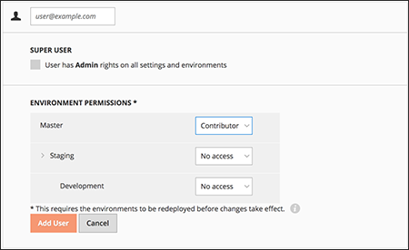
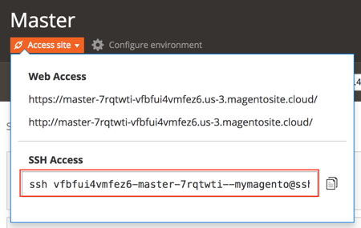

# Attiva il tuo [!DNL MBI] Account per `Cloud Starter` Abbonamenti

Per attivare [!DNL MBI] per `Cloud Starter` progetti, creare prima un [!DNL MBI] account, quindi crea un `SSH` , quindi connettiti al tuo database Commerce. Vedi [attivazione delle sottoscrizioni on-premise](../getting-started/onpremise-activation.md).

>[!NOTE]
>
>Per informazioni sull&#39;attivazione [!DNL MBI] per `Cloud Pro` ai progetti, contattare il proprio Customer Success Manager o il proprio Customer Technical Advisor.

1. Crea il tuo [!DNL MBI] Conto.

   - Vai a [Accesso all’account Adobe Commerce](https://account.magento.com/customer/account/login)

   - Vai a **[!UICONTROL My Account** > **My [!DNL MBI] Instances]**.

   - Fai clic su **[!UICONTROL Create Instance]**. Se non trovi questo pulsante, contatta il tuo Customer Success Manager o Customer Technical Advisor.

   - Seleziona la tua `Cloud Starter` abbonamento. Se hai solo un `cloud starter` abbonamento selezionato automaticamente.

   - Fai clic su **[!UICONTROL Continue]**.

   - Inserisci le tue informazioni per creare il tuo account.

   

   - Vai alla tua casella in entrata e verifica il tuo indirizzo e-mail.

   

   - Crea la tua password.

   

   - Dopo aver creato il tuo account avrai la possibilità di aggiungere utenti al tuo nuovo account. È ora possibile aggiungere gli amministratori tecnici per eseguire le seguenti operazioni.

   

1. Inserisci informazioni sul tuo negozio per impostare le tue preferenze.

   

   È necessario raccogliere alcune informazioni prima di poter collegare il database per il terzo passaggio del flusso di onboarding. Riempirà il `Connect your database` nel passaggio 9.

1. Crea dedicato [!DNL MBI] Utente.

   - Crea un nuovo utente nel tuo [Account Adobe Commerce](https://accounts.magento.com).

   - _Perché un nuovo utente?_ [!DNL MBI] richiede che un utente aggiunto al progetto recuperi continuamente nuovi dati da trasferire al [!DNL MBI] data warehouse. Questo utente fungerà da connessione. L’aggiunta di questo utente al progetto verrà eseguita nel passaggio 4.

   - Il motivo per avere un [!DNL MBI] l&#39;utente deve evitare che l&#39;utente aggiunto venga inavvertitamente disattivato o eliminato e che venga interrotto il [!DNL MBI] connessione.

1. Aggiungi l’utente appena creato all’ambiente principale del progetto come `Contributor`.

   

1. Ottieni il tuo [!DNL MBI] `SSH` chiavi.

   - Vai a `Connect your database` della pagina [!DNL MBI] configura l’interfaccia utente e scorri verso il basso per `Encryption settings`.

   - Per `Encryption Type` campo, scegli `SSH Tunnel`.

   - Dall’elenco a discesa, puoi copiare e incollare il [!DNL MBI] `Public Key`.

   

1. Aggiungi il nuovo [!DNL MBI] `Public key` al [!DNL MBI] creato nel passaggio 5.

   - Vai a [il tuo account Adobe Commerce cloud](https://accounts.magento.cloud/). Accedi con le informazioni di accesso dell&#39;account per il nuovo [!DNL MBI] creato dall&#39;utente. Quindi vai al `Account Settings` scheda .

   - Scorri verso il basso nella pagina ed espandi il menu a discesa per `SSH` chiavi. Quindi fai clic su **[!UICONTROL Add a public key]**.

   

   - Aggiungi il [!DNL MBI] `SSH Public Key` dall&#39;alto.

   

1. Fornire [!DNL MBI] Credenziali MySQL.

   - Aggiorna il tuo `.magento/services.yaml`

   ```sql
   mysql:
       type: mysql:10.0
       disk: 2048
       configuration:
           schemas:
               - main
           endpoints:
               mysql:
                   default_schema: main
                   privileges:
                       main: admin
               mbi:
                   default_schema: main
                   privileges:
                       main: ro
   ```

   - Aggiorna il tuo `.magento.app.yaml`

   ```sql
           relationships:
               database: "mysql:mysql"
               mbi: "mysql:mbi"
               redis: "redis:redis"
   ```

1. Ottieni informazioni per la connessione del database a [!DNL MBI].

   Esegui
   `echo $MAGENTO_CLOUD_RELATIONSHIPS | base64 --decode | json_pp`

   per ottenere informazioni sulla connessione del database.

   Dovresti ricevere informazioni simili all’output seguente:

   ```json
           "mbi" : [
                 {
                    "scheme" : "mysql",
                    "rel" : "mbi",
                    "cluster" : "vfbfui4vmfez6-master-7rqtwti",
                    "query" : {
                       "is_master" : true
                    },
                    "ip" : "169.254.169.143",
                    "path" : "main",
                    "host" : "[!DNL MBI].internal",
                    "hostname" : "3m7xizydbomhnulyglx2ku4wpq.mysql.service._.magentosite.cloud",
                    "username" : "mbi",
                    "service" : "mysql",
                    "port" : 3306,
                    "password" : "[password]"
                 }
              ],
   ```

1. Collegare il database Commerce

   

   - `Integration Name`: [Scegli un nome per l’integrazione.]

   - `Host`: `[!DNL MBI].internal`

   - `Port`: `3306`

   - `Username`: `mbi`

   - `Password`: [password di input fornita nell&#39;output per il passaggio 8.]

   - `Database Name`: `main`

   - `Table Prefixes`: [lascia vuoto se non sono presenti prefissi di tabella]

1. Imposta le impostazioni del fuso orario.

   

   - `Database`: `Timezone: UTC`

   - `Desired Timezone`: [Scegli il fuso orario in cui visualizzare i dati.]

1. Ottieni informazioni sulle impostazioni di crittografia.

   - L’interfaccia utente del progetto fornisce un `SSH` stringa di accesso. Questa stringa può essere utilizzata per raccogliere le informazioni necessarie per `Remote Address` e `Username` nella configurazione del `Encryption` impostazioni. Utilizza la `SSH Access` trova facendo clic sul pulsante del sito di accesso nel ramo principale dell’interfaccia utente di Project e trova la tua `User Name` e `Remote Address` come mostrato di seguito.

   

   

1. Informazioni di input per `Encryption` impostazioni

   

   **Ingressi**

   - `Encryption Type`: `SSH Tunnel`

   - `Remote Address`: `ssh.us-3.magento.cloud`

   - `Username`: `vfbfui4vmfez6-master-7rqtwti--mymagento`

   - `Port`: `22`

1. Fai clic su **[!UICONTROL Save Integration]**.

1. La connessione alla [!DNL MBI] conto.

1. Dopo la connessione [!DNL MBI] al database Commerce, contatta il tuo Customer Success Manager per coordinare i passaggi successivi, ad esempio la configurazione di integrazioni e altri passaggi di configurazione.

1. Al termine della configurazione, puoi [accedere](../getting-started/sign-in.md) al tuo [!DNL MBI] conto.
