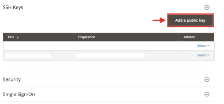

# Attiva il tuo account [!DNL Commerce Intelligence] per le sottoscrizioni locali e iniziali

Per attivare [!DNL Commerce Intelligence] per le sottoscrizioni on-premise, creare innanzitutto un account [!DNL Commerce Intelligence], immettere le informazioni sulle impostazioni, quindi connettere [!DNL Commerce Intelligence] al database [!DNL Commerce]. <!-- For information about activation in `Cloud Starter` projects, see [Activating your [!DNL Commerce Intelligence] Account for `Cloud Starter` Subscriptions](../getting-started/cloud-activation.md).-->

## Crea il tuo account [!DNL Commerce Intelligence]

Per creare il tuo account, contatta il tuo Adobe Account Team o Customer Technical Advisor.

## Crea la password

Dopo la creazione dell&#39;account, controllare l&#39;indirizzo di posta elettronica per un messaggio di notifica dell&#39;account da [!DNL The Magento BI Team@rjmetrics.com]. Utilizza il collegamento fornito nell&#39;e-mail per accedere al tuo account [!DNL Commerce Intelligence] e creare la tua password. Vai alla tua casella in entrata e verifica il tuo indirizzo e-mail.

Se non hai ricevuto un&#39;e-mail, [contatta l&#39;assistenza](https://experienceleague.adobe.com/docs/commerce-knowledge-base/kb/troubleshooting/miscellaneous/mbi-service-policies.html?lang=it).

## Imposta le preferenze del Negozio

Prima di configurare la connessione al database, completare il modulo per le informazioni sull&#39;archivio. Queste informazioni sono necessarie per completare l&#39;installazione di **[!UICONTROL Connect your Database]**.

## Aggiungi [!DNL Commerce Intelligence] utenti

Dopo aver impostato la password e aver effettuato l&#39;accesso a [!DNL Commerce Intelligence], puoi aggiungere altri utenti al tuo account [!DNL Commerce Intelligence]. Quando aggiungi degli utenti, aggiungi gli utenti amministratore con le autorizzazioni appropriate per completare il processo di attivazione.

## Crea un utente [!DNL Commerce Intelligence] dedicato nell&#39;amministratore [!DNL Commerce]

Per utilizzare [!DNL Commerce Intelligence], è necessario aggiungere un utente permanente e dedicato al progetto [!DNL Commerce]. Questo utente dedicato funge da connessione permanente a [!DNL Commerce] che consente il recupero e il trasferimento di nuovi dati al Data Warehouse [!DNL Commerce Intelligence] dell&#39;account.

La configurazione di un utente [!DNL Commerce Intelligence] dedicato garantisce che l&#39;account non venga disattivato o eliminato, interrompendo così la connessione [!DNL Commerce Intelligence].

>[!NOTE]
>
>Adobe incoraggia l’utilizzo di un nome di account che ne indichi lo stato permanente (ad esempio ACI-dedicato, ACI-database-connector e così via).

Dopo aver creato l&#39;utente dedicato per [!DNL Commerce Intelligence] nell&#39;amministratore, aggiungere lo stesso utente all&#39;ambiente primario del progetto [!DNL Commerce] con l&#39;impostazione **[!UICONTROL Master]** di `Contributor`.

## Ottieni le chiavi SSH di Commerce Intelligence

1. Nella pagina [!UICONTROL Connect your database] per la configurazione di [!DNL Commerce Intelligence], scorrere verso il basso e selezionare **[!UICONTROL Encryption settings]**.

1. Per **Tipo di crittografia**, selezionare `SSH Tunnel`.

1. Dall’elenco a discesa, copia la chiave pubblica fornita.

   

## Aggiungi la chiave pubblica a [!DNL Commerce Intelligence]

1. Da [!DNL Commerce Admin], accedere utilizzando le informazioni di accesso per l&#39;utente [!DNL Commerce Intelligence] appena creato.

1. Selezionare la scheda **Impostazioni account**.

1. Scorri verso il basso ed espandi il menu a discesa **[!UICONTROL SSH Keys]**. Quindi, selezionare **[!UICONTROL Add a public key]**.

   

1. Incolla la chiave pubblica copiata nel passaggio [!DNL Encryption Type] precedente.

   

## Fornisci credenziali [!DNL Commerce Intelligence] di Essentials `MySQL`

1. Aggiorna `.magento/services.yaml`.

   

1. Aggiorna `.magento.app.yaml`.

   

## Ottieni informazioni sulla connessione al database

Ottiene le informazioni sulla connessione al database [!DNL Commerce] in [!DNL Commerce Intelligence]

1. Eseguire il comando seguente per ottenere le informazioni.

   `echo $MAGENTO_CLOUD_RELATIONSHIPS | base64 --decode | json_pp`

1. Esaminare le informazioni del database, che devono essere simili a quelle dell&#39;esempio seguente.

   

## Connetti [!DNL Commerce Intelligence] al database [!DNL Commerce] utilizzando una connessione crittografata

>[!NOTE]
>
>Adobe consiglia vivamente di utilizzare un tunnel [`SSH tunnel`](../data-analyst/importing-data/integrations/mysql-via-ssh-tunnel.md) per stabilire la connessione al database. Tuttavia, se questo metodo non è un&#39;opzione, è comunque possibile collegare [!DNL Commerce Intelligence] al database utilizzando [`direct connection`](../data-analyst/importing-data/integrations/mysql-via-a-direct-connection.md).

Immettere le informazioni di [!DNL Commerce Intelligence] nella schermata [!UICONTROL Connect your Magento Database].

**Input:**

[!UICONTROL Integration Name]: [scegliere un nome per l&#39;istanza [!DNL Commerce Intelligence]]

[!UICONTROL Host]: `mbi.internal`

[!UICONTROL Port]: `3306`

[!UICONTROL Username]: `mbi`

[!UICONTROL Password]: [password di input visualizzata nella sezione precedente]

[!UICONTROL Database Name]: `main`

[!UICONTROL Table Prefixes]: [lascia vuoto se non sono presenti prefissi di tabella]

## Imposta il tuo [!UICONTROL **fuso orario**]

**Input:**

[!UICONTROL Database Timezone]: `UTC`

[!UICONTROL Desired Timezone]: [scegli il fuso orario per il quale vuoi visualizzare i dati]

## Ottenere le informazioni sulle impostazioni di crittografia

L’interfaccia utente del progetto fornisce una stringa di accesso SSH. Questa stringa può essere utilizzata per raccogliere le informazioni necessarie per [!UICONTROL **Indirizzo remoto**] e [!UICONTROL **Nome utente**]. Utilizza la stringa di accesso SSH selezionando il pulsante del sito di accesso nel ramo principale dell’interfaccia utente del progetto. Quindi, trova [!UICONTROL User Name] e [!UICONTROL Remote Address] come mostrato di seguito.

## Immettere le impostazioni di [!DNL Encryption]

**Input:**

[!UICONTROL Encryption Type]: `SSH Tunnel`

[!UICONTROL Remote Address]: `ssh.us-3.magento.cloud` [dal passaggio precedente]

[!UICONTROL Username]: `vfbfui4vmfez6-master-7rqtwti—mymagento` [dal passaggio precedente]

[!UICONTROL Port]: `22`

## Salva l’integrazione.

Dopo aver completato i passaggi di configurazione, applicare le modifiche selezionando [!UICONTROL **Salva integrazione**].

Il database [!DNL Commerce] è stato connesso all&#39;account [!DNL Commerce Intelligence].

>[!NOTE]
>
>Se sei un cliente [!DNL Adobe Commerce Intelligence Pro], contatta il tuo Customer Success Manager o il tuo consulente tecnico per coordinare i passaggi successivi.

Dopo aver completato la configurazione, [accedi](../getting-started/sign-in.md) al tuo account [!DNL Commerce Intelligence].

<!---# Activate your [!DNL Commerce Intelligence] Account

To activate [!DNL Commerce Intelligence] for on-premise or `Cloud Pro` subscriptions, [contact support](https://experienceleague.adobe.com/docs/commerce-knowledge-base/kb/troubleshooting/miscellaneous/mbi-service-policies.html?lang=it).

>[!NOTE]
>
>Adobe no longer supports new `Cloud Starter` subscriptions.--->
