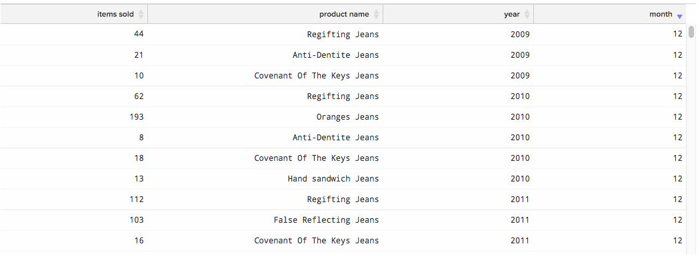

# Creare visualizzazioni da query SQL

L&#39;obiettivo di questo tutorial è quello di acquisire familiarità con la terminologia utilizzata nel [!DNL SQL Report Builder] e fornire una solida base per la creazione di `SQL visualizations`.

Il [[!DNL SQL Report Builder]](../data-analyst/dev-reports/sql-rpt-bldr.md) è un generatore di rapporti con opzioni: puoi eseguire una query al solo scopo di recuperare una tabella di dati oppure puoi trasformare tali risultati in un rapporto. Questo tutorial spiega come creare una visualizzazione da una query SQL.

## Terminologia

Prima di iniziare questo tutorial, consulta la terminologia seguente utilizzata nel `SQL Report Builder`.

- `Series`: la colonna che desideri misurare è indicata come Serie nel Report Builder SQL. Esempi comuni sono `revenue`, `items sold`, e `marketing spend`. Almeno una colonna deve essere impostata come `Series` per creare una visualizzazione.

- `Category`: la colonna che desideri utilizzare per segmentare i dati è denominata `Category` Questo è proprio come `Group By` funzionalità in [`Visual Report Builder`](../data-user/reports/ess-rpt-build-visual.md). Ad esempio, se desideri segmentare i ricavi del ciclo di vita dei clienti in base all&#39;origine di acquisizione, la colonna che contiene l&#39;origine di acquisizione viene specificata come `Category`. È possibile impostare più colonne come `Category`.

>[!NOTE]
>
>Date e marche temporali possono essere utilizzate anche come `Categories`. Si tratta solo di un’altra colonna di dati nella query e deve essere formattata e ordinata come desiderato nella query stessa.

- `Labels`: vengono applicate come etichette dell’asse x. Quando si analizzano i dati con tendenze nel tempo, le colonne anno e mese vengono specificate come etichette. È possibile impostare più colonne come Etichetta.

## Passaggio 1: scrivere la query

Considera quanto segue:

- Il [!DNL SQL Report Builder] utilizza [`Redshift SQL`](https://docs.aws.amazon.com/redshift/latest/dg/c_redshift-and-postgres-sql.html).

- Se stai creando un rapporto con una serie temporale, assicurati di `ORDER BY` le colonne timestamp. In questo modo le marche temporali vengono tracciate nell’ordine corretto sul rapporto.

- Il `EXTRACT` è utile per analizzare il giorno, la settimana, il mese o l’anno della marca temporale. Questa funzione è utile quando `time interval` che desideri utilizzare per il report è `daily`, `weekly`, `monthly`, o `yearly`.

Per iniziare, apri [!DNL SQL Report Builder] facendo clic su **[!UICONTROL Report Builder** > **SQL Report Builder]**.

Ad esempio, considera questa query che restituisce il numero totale mensile di articoli venduti per ciascun prodotto:

```sql
    SELECT SUM("qty") AS "Items Sold", "products's name" AS "product name",
    EXTRACT(year from "Order date") AS "year",
    EXTRACT(month from "Order date") AS "month"
    FROM "items"
    WHERE "products's name" LIKE '%Jeans'
    GROUP BY  "products's name", "year","month"
    ORDER BY "year" ASC,"month" ASC
    LIMIT 3500
```

Questa query restituisce questa tabella di risultati:



## Passaggio 2: creare la visualizzazione

Con questi risultati, *come si crea la visualizzazione?* Per iniziare, fai clic su **[!UICONTROL Chart]** scheda in `Results` riquadro. Viene visualizzata la `Chart settings` scheda.

Quando si esegue una query per la prima volta, il report potrebbe risultare imperscrutabile perché tutte le colonne della query vengono tracciate come una serie:


In questo esempio, vuoi che sia un grafico a linee con tendenze nel tempo. Per crearlo, usa le seguenti impostazioni:

- `Series`: seleziona la `Items sold` colonna come `Series` perché desideri misurarla. Dopo aver definito un `Series` nella colonna viene visualizzata una singola riga tracciata nel rapporto.

- `Category`: per questo esempio, vuoi visualizzare ogni prodotto come una riga diversa nel rapporto. A questo scopo, imposta `Product name` come `Category`.

- `Labels`: utilizza le colonne `year` e `month` come etichette sull’asse x per poter visualizzare `Items Sold` come tendenza nel tempo.

>[!NOTE]
>
>La query deve contenere un `ORDER BY` sulle etichette se sono `date`/`time` colonne.

Di seguito è riportato un rapido riepilogo su come hai creato questa visualizzazione, dall’esecuzione della query alla configurazione del rapporto:


## Passaggio 3: selezionare un `Chart Type`

In questo esempio viene utilizzato `Line` tipo di grafico. Per utilizzare un `chart type`, fai clic sulle icone sopra la sezione delle opzioni del grafico per modificarla:


## Passaggio 4: salvare la visualizzazione

Se desideri utilizzare di nuovo questo rapporto, assegna un nome al rapporto e fai clic su **[!UICONTROL Save]** in alto a destra.

Nel menu a discesa, seleziona `Chart` come `Type` e quindi una dashboard in cui salvare il rapporto.

## Ritorno a capo

Vuoi fare un passo avanti? Consulta la sezione [best practice di ottimizzazione delle query](../best-practices/optimizing-your-sql-queries.md).
