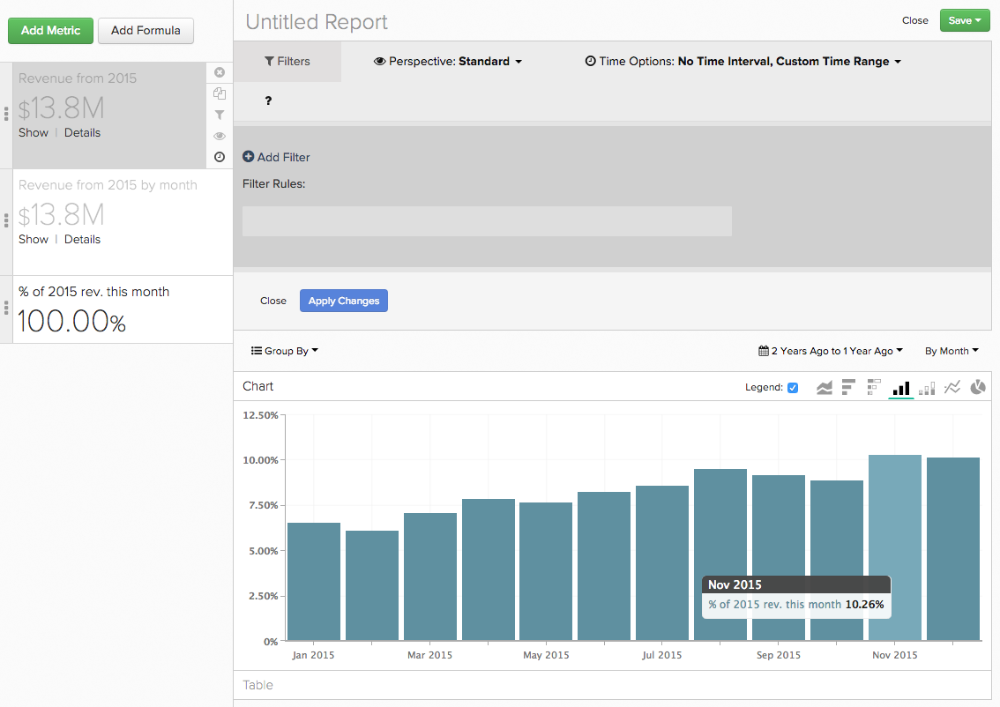

# Utilizzo `Time` Opzioni in `Visual Report Builder`

Una delle caratteristiche del `Visual Report Builder` è globale `Time Range` e `Interval` impostazioni. Queste impostazioni ti consentono di analizzare i dati nel rapporto per un periodo di tempo specifico.

Tuttavia, per alcune analisi, potrebbe essere necessario considerare intervalli di tempo o intervalli di tempo diversi nello stesso rapporto. Ecco dove `Time` Le opzioni entrano. Per darti un&#39;idea migliore di come utilizzare `Time` Nelle opzioni dei rapporti, questa esercitazione riguarderà i seguenti casi d’uso:

* [Analisi delle metriche senza marca temporale](#notimestamp)
* [Dare a una metrica un intervallo di tempo indipendente](#independenttimeinterval)
* [Confronto della stessa metrica tra intervalli di tempo diversi](#difftimerange)

Per seguire alcuni dei rapporti di esempio trattati in questo argomento, apri la [`Visual Report Builder`](../data-user/reports/ess-rpt-build-visual.md) prima di continuare.

## Analisi delle metriche senza marca temporale {#notimestamp}

Alcune metriche semplicemente non possono avere tendenze nel tempo perché i dati non vengono raccolti o memorizzati con una marca temporale associata. Ad esempio, una tabella di inventario spesso contiene una sola riga per ogni SKU. In tal caso, dovresti [creare la metrica](../data-user/reports/ess-manage-data-metrics.md) senza specificare una marca temporale.

Quando si utilizza tale metrica nel rapporto, si nota che l’aggiunta di questa metrica a un rapporto imposta automaticamente un `Time Interval` di `None` e `Time Range` di `Global`:

## Dare a una metrica un intervallo di tempo indipendente {#independenttimeinterval}

`Time` Le opzioni ti consentono di creare grafici basati sul tempo al 100% per identificare il giorno, la settimana, il mese o l’anno con il maggior valore in un intervallo di tempo specifico. In questa sezione viene creato un grafico che mostra la percentuale di ricavi generati in ogni mese di calendario di un anno.

Questo tipo di rapporto può essere utile se desideri confrontare i ricavi generati anno su anno. Ad esempio, se un grafico per il 2015 rivelasse che gennaio ha contribuito per il 18% delle entrate per l&#39;anno e per il 2016 mostrava solo l&#39;8%, si potrebbe iniziare a cercare quello che potrebbe essere successo.

1. Aggiungi il tuo `Revenue` al rapporto.
1. Fai clic su **[!UICONTROL Duplicate]** per creare una copia della metrica.
1. Fai clic sul pulsante globale **[!UICONTROL Time Range]** opzione , quindi **[!UICONTROL Moving Time Range]**. Imposta questo su `Last Year`.
1. Fai clic sul pulsante globale **[!UICONTROL Time Interval]** e impostalo su `Monthly`.
1. Il Report Builder aggiunge automaticamente un secondo asse Y per una seconda metrica. Deseleziona la `Multiple Y-Axes` scatola.
1. Successivamente, applichiamo un `Time Interval` alla prima metrica. Fai clic su **[!UICONTROL Time Options]** (icona dell&#39;orologio) a destra `first Revenue metric`.
1. Fai clic su **[!UICONTROL Time Options]** nella finestra espansa visualizzata sopra il report.
1. Nel menu a discesa , imposta quanto segue:

   * `Time Interval`: imposta questa opzione su `None`.

   * `Time Range`: imposta questa opzione su `Last Year` facendo clic **[!UICONTROL Custom]**, quindi **[!UICONTROL Moving Range]** e infine selezionando la `Last Year` opzione .

   * Fai clic su **[!UICONTROL Apply]** per salvare le impostazioni di intervallo e intervallo. In questo modo viene creata una metrica che calcola il ricavo totale per l’anno precedente. Quindi, utilizziamo questa metrica come denominatore in una formula.

   * Per visualizzare la percentuale di ricavi per ogni mese, è necessario aggiungere una formula al rapporto. Fai clic su **[!UICONTROL Add Formula]**.

   * Invio `B/A` nel campo formula e seleziona `% Percent` dall’elenco a discesa accanto al campo di testo. Questa formula suddivide l&#39;importo dei ricavi di un mese specifico dello scorso anno per l&#39;importo totale dei ricavi dello scorso anno.

   * Fai clic su **[!UICONTROL Apply Changes]**.

   * Nascondere entrambe le metriche di input e rinominare la formula.

Ora possiamo vedere quanto è stato incisivo ogni mese l&#39;anno scorso:

## Confronto della stessa metrica tra intervalli di tempo diversi {#difftimerange}

In questo esempio viene utilizzata una dimensione personalizzata denominata `Day number of the month`. Se desideri creare questo rapporto e non hai già questa dimensione nella tua Data Warehouse, [contattare il supporto](https://experienceleague.adobe.com/docs/commerce-knowledge-base/kb/troubleshooting/miscellaneous/mbi-service-policies.html?lang=en) per assistenza.

I due esempi più comuni in questa categoria sono (1) il confronto tra le metriche di crescita (anno dei ricavi su anno o mese su mese) e (2) la migliore comprensione delle recenti tendenze di vendita di scorte o articoli.

Per illustrare questo caso d’uso, osserviamo le entrate giornaliere del mese precedente rispetto allo stesso mese dell’anno precedente. Diciamo che vogliamo guardare le entrate per ogni giorno di gennaio 2016 e poi confrontarle con gennaio 2015, gennaio 2014 e così via - questo rapporto ci mostrerebbe questo.

1. Aggiungi il tuo `Revenue` al rapporto.
1. Fai clic su **[!UICONTROL Duplicate]** per creare una copia della metrica.
1. Rinomina la prima metrica in `Items sold last 7 days` e la seconda metrica a `Items sold last 28 days`.
1. Fai clic su **[!UICONTROL Time Range]**, quindi **[!UICONTROL Moving Time Range]**. Imposta questo su `Last Month`.
1. Fai clic su **[!UICONTROL Time Interval]** e impostarlo su `None`.
1. Fai clic su **[!UICONTROL Time Options]** (icona orologio) accanto al secondo `Revenue` metrica.
1. Fai clic su **[!UICONTROL Time Options]** nella finestra espansa visualizzata sopra il report.
1. Nel menu a discesa , imposta quanto segue:

   * `Time Interval`: imposta questa opzione su `None`.

   * `Time Range`: imposta questa opzione su `From 14 Months Ago To 13 Months Ago` facendo clic **[!UICONTROL Custom]** then **[!UICONTROL Moving Range]**. Utilizza i campi e i menu a discesa nella parte superiore del menu per impostare l’intervallo. Questa impostazione consente di visualizzare le entrate del mese precedente, ma dell’anno precedente.
   Non preoccuparti se la metrica scompare dal rapporto: l’impostazione di opzioni di tempo indipendenti nasconde automaticamente la metrica dal rapporto. Per visualizzarlo nuovamente, fai clic su **[!UICONTROL Show]** accanto alla metrica.

   

   * Fai clic su **[!UICONTROL Apply]** per salvare le impostazioni di intervallo e intervallo.

   * Ora aggiungiamo la nostra personalizzazione `Day number of the month` dimensione facendo clic su **[!UICONTROL Group By]** e selezionando la dimensione. Questo restituirà il numero del giorno del mese di un ordine - ad esempio, un ordine effettuato il 2 marzo restituirà `2`.

   * In `Group By` a discesa, seleziona `Show All` e fai clic su **[!UICONTROL Apply]**. In questo modo i valori dell&#39;asse X verranno effettivamente creati per il rapporto:

   

   * Rinomina le metriche. Nel nostro esempio, la prima metrica è `Revenue - 2015` e la seconda è `Revenue - 2014`.

Un altro uso comune di `Time Options` determina le settimane di fornitura. Soprattutto durante le feste o un periodo promozionale speciale, è possibile considerare gli articoli venduti nell&#39;ultima settimana, mese e periodo promozionale precedente per prendere decisioni di acquisto informate.

Ricorda di impostare gli intervalli di tempo in base alle esigenze durante la creazione del rapporto.

1. Aggiungi il tuo `Items Sold` al rapporto.
1. Fai clic su **[!UICONTROL Duplicate]** per creare una copia della metrica.
1. Rinomina le metriche. È possibile utilizzare gli stessi nomi o utilizzare qualcosa di simile:
   1. Rinomina la prima metrica in `Items sold last 7 days`.
   1. Rinomina la seconda metrica in `Items sold last 28 days`.
1. Sulla `Items sold last 7 days` metrica, fai clic su globale **[!UICONTROL Time Range]** opzione then **[!UICONTROL Moving Time Range]**. Per questo esempio, lo impostiamo su `Last 7 Days`.
1. Fai clic su **[!UICONTROL Time Interval]** e impostarlo su `None`.
1. Poi, definiamo il `Time Options` per `Items sold last 28 days` metrica. Fai clic su **[!UICONTROL Time Options]** (icona dell&#39;orologio) a destra `second Items sold` metrica.
1. Fai clic su **[!UICONTROL Time Options]** nella finestra espansa visualizzata sopra il report.
1. Nel menu a discesa , imposta quanto segue:

   * `Time Interval`: imposta questa opzione su `None`.
   * `Time Range`: imposta questa opzione su `From 29 days to 1 day ago` facendo clic **[!UICONTROL Custom]**, quindi **[!UICONTROL Moving Range]**. Utilizza i campi e i menu a discesa nella parte superiore del menu per impostare l’intervallo.
   * Fai clic su **[!UICONTROL Apply]** per salvare le impostazioni di intervallo e intervallo.
   * Duplica la `Items sold last 28 days` e apri la nuova metrica `Time Options`. Imposta le opzioni seguenti:

      * `Time Interval`: lascia questo come `None`.
      * `Time Range`: modifica l’intervallo di date che si allinea alla promozione desiderata facendo clic su **[!UICONTROL Specific Date Range]** e quindi inserire le date appropriate.
      * Rinomina la metrica `Items sold during last promotion` o qualcosa di simile.
      * Aggiungi il tuo `Units on hand` metrica.
      * Quindi, dobbiamo aggiungere i calcoli che ci mostrano le settimane a disposizione, considerando le tendenze di vendita, per i periodi di tempo (`last 7 days`, `last 28 days`e `last promo` punto) della relazione. È necessario eseguire questa operazione una volta per ogni periodo di tempo.

Per creare le formule, fare clic su **[!UICONTROL Add Formula]**. Inserisci le formule seguenti e fai clic su **[!UICONTROL Apply Changes]** una volta finito. Ripeti questa operazione per ciascuno dei tre periodi di tempo:

* Per `last 7 days time period`, inserisci `D / A` in `Formula` campo .
* Per `last 28 days time period`, inserisci `D / (B/4)` in `Formula` campo .

   >[!NOTE]
   >
   >È importante normalizzare qui gli intervalli di tempo selezionati. 28 giorni dovrebbero essere suddivisi in quattro settimane in questo esempio. Potrebbe essere necessario applicare una logica diversa alla formula.

* Per `last promo period`, inserisci `D / C` in `Formula` campo .

   

* Infine, personalizza il rapporto nascondendo le metriche e aggiungendo un `SKU` o una dimensione simile al rapporto come `Group By`.

Questo esempio dimostra che i livelli di inventario correnti erano ben posizionati per una vendita di 14 giorni su tutto il prodotto. Tuttavia, l&#39;aggiunta di un periodo promozionale comparabile suggerisce che l&#39;azienda deve apportare alcune modifiche, sia ordinando più scorte che promuovendo solo gli articoli con sufficienti unità in magazzino.

Poiché i tuoi clienti si comportano in modo diverso nel tempo, puoi aspettarti di vedere varianze di dati durante l’esecuzione delle analisi. L’impostazione di opzioni personalizzate per l’ora consente di creare rapidamente analisi complesse, consentendo decisioni basate sui dati che influenzano le tendenze della cronologia.

