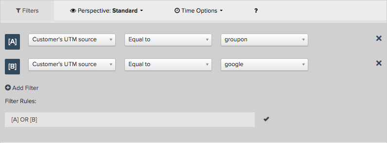
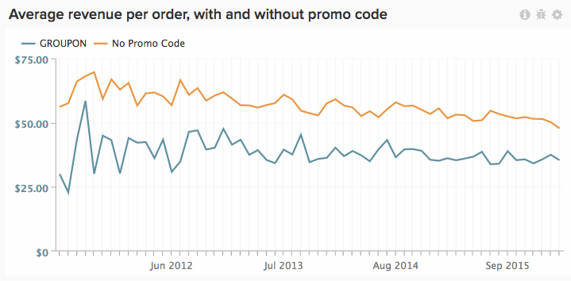
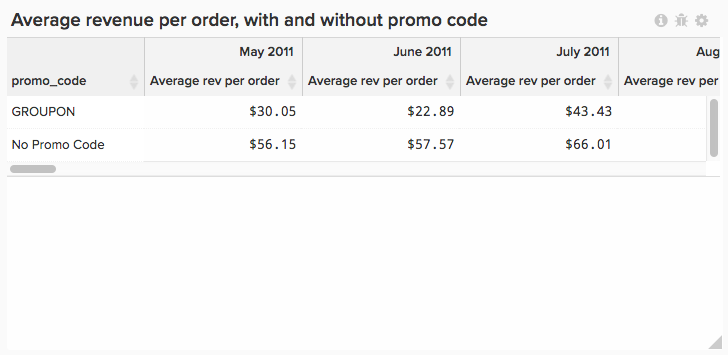

# Utilizza [!DNL Visual Report Builder]

[[!DNL Visual Report Builder]](../data-user/reports/ess-rpt-build-visual.md) ti consente di esplorare visivamente i tuoi dati per trarre informazioni approfondite e contribuire alle decisioni di business. Questo tutorial illustra il processo di creazione di un rapporto di base.

>[!NOTE]
>
>Per aggiungere un report a un dashboard, sono necessarie `Standard` [autorizzazioni utente](../administrator/user-management/user-management.md) e `Edit` accesso al dashboard.

## Passaggio 1: creazione di un rapporto

Per iniziare a creare un report, fai clic su **[!UICONTROL Report Builder]** nella barra laterale o su **[!UICONTROL Add Report]** nella parte superiore di qualsiasi dashboard. Quando viene visualizzata la pagina `Report Builder`, fare clic sull&#39;opzione **[!UICONTROL Visual Report Builder]**.

Per modificare un report creato in [!DNL Visual Report Builder], fare clic sull&#39;icona a forma di ingranaggio (opzioni) nell&#39;angolo superiore destro di qualsiasi grafico, quindi fare clic su **[!UICONTROL Edit]**.

## Passaggio 2: aggiunta di metriche

Il primo passaggio nella creazione di un&#39;analisi consiste nel selezionare [la metrica](../data-user/reports/ess-manage-data-metrics.md) da analizzare. Anche se le metriche sono elencate in ordine alfabetico per impostazione predefinita, è possibile raggrupparle in base alla tabella che attiva la metrica.

Puoi aggiungere altre metriche dopo aver selezionato la metrica iniziale e sovrapporre tutte le metriche in un singolo rapporto oppure eseguire calcoli multimetrici aggiungendo formule.

## Passaggio 3: aggiunta di `Formulas`

`Formulas` vengono aggiunti ai report facendo clic su **[!UICONTROL Add Formula]**, che si trova appena sopra l&#39;elenco delle metriche nel report. Nell&#39;[editor formule](../data-analyst/dev-reports/formulas-in-rpt-bldr.md), è possibile utilizzare come input qualsiasi metrica inclusa nel report. Gli operatori matematici di base vengono utilizzati per manipolare le diverse metriche.

Si supponga di voler creare un rapporto che mostri i ricavi medi per ordine. In questo caso, la metrica `Revenue` viene divisa per la metrica `Number of orders`.

## Passaggio 4: impostazione di `Time Period` e `Interval of Analysis` {#time}

Per azzerare in un particolare intervallo di tempo, potete impostare il periodo di tempo per l&#39;analisi. Puoi anche scegliere intervalli di tempo per segmentare i dati (ad esempio per anno, per trimestre o per mese). Utilizzare i menu nell&#39;angolo superiore destro del grafico per impostare il periodo di tempo e l&#39;intervallo.

Quando imposti un intervallo di date specifico per il periodo di tempo, assicurati che la data di inizio sia all’inizio dell’intervallo e la data di fine sia alla fine dell’intervallo.

Ad esempio, se si imposta un periodo di tempo compreso tra `January 1st` e `March 1st` e si sceglie un intervallo di `monthly`, `March` verrà visualizzato come punto dati, ma verrà ignorato ogni giorno in `March` eccetto `March 1`. In tal caso, è necessario creare `Time Period` da `January 1 to March 31`.

## Passaggio 5: `Group by` / `Segmenting the Analysis` {#groupby}

[Per segmentare le metriche in base a una dimensione dati](../best-practices/segment-filter.md), fare clic sul menu **[!UICONTROL Group by]** in alto a sinistra del grafico. Questo mostra un menu a discesa che include tutte le dimensioni disponibili della prima metrica inclusa nell’elenco.

È possibile scegliere `None` per impedire la segmentazione di una metrica. Ad esempio, potresti desiderare una metrica che restituisca i ricavi totali senza essere segmentato, mentre un’altra metrica ricavi dovrebbe essere segmentata per regione.

Torna all’esempio delle entrate medie per ordine e imposta il Raggruppa per sul codice promozionale. Questo mostra i ricavi medi per ordine per ordini con e senza codice promozionale.

Se le metriche incluse nell’analisi sono basate su tabelle di dati diverse, un pop-up ti consente di selezionare la dimensione dati corrispondente in ogni tabella. L’obiettivo qui è quello di trovare dimensioni che condividono il tipo di valori per la segmentazione:

## Passaggio 6: impostazione di `Metric Filters`, `Perspective` e `Time Interval` {#metric-specific}

Per ogni metrica aggiunta all&#39;analisi, puoi aggiungere filtri, selezionare la prospettiva dati rilevante e impostare le opzioni `time interval`. Per accedere a queste funzionalità, fare clic sulle icone imbuto (`Filter`), occhio (`Perspective`) e orologio (`Time`) accanto alle metriche incluse nel report.

### `Filters`

`Filters` limita il set di dati incluso nell&#39;analisi. I filtri sono utili, ad esempio, quando si valutano singoli canali di acquisizione e si rimuovono i valori erratici.

Oltre ai menu a discesa e alla casella di testo, è possibile utilizzare anche operatori di filtro speciali, ad esempio `LIKE` o `IN`, per creare i filtri.

L&#39;utilizzo di caratteri jolly (`%` o `_`) con istruzioni `LIKE` è supportato. Il carattere jolly `%` corrisponde a più caratteri, mentre `_` corrisponde a un solo carattere. Ad esempio:

- `affiliate's name Like B%` consente solo i dati dei clienti il cui nome inizia con `B`.

- `affiliate's name Like _ake` consente solo i dati dei clienti i cui nomi sono `Jake`, `Rake` o `Bake` ma non `Drake` o `Blake`.

L’aggiunta di più filtri consente un controllo rigoroso dei dati del grafico. Per impostazione predefinita, tutte le condizioni del filtro devono essere true per includere una parte di dati, ma è possibile creare relazioni OR modificando la casella di testo Regole filtro.

### `Perspectives`

`Perspectives` Consente di passare facilmente da una visualizzazione all&#39;altra dei dati. Osserva le opzioni disponibili:

- `Standard perspective`: la prospettiva standard mostra il risultato per la data corrispondente sull&#39;asse x (ad esempio i ricavi di gennaio). Questa è la prospettiva utilizzata nell&#39;esempio Ricavo medio per ordine.

- Prospettiva `Amount` OR `Percent Change` rispetto a `Previous Period`: questa prospettiva mostra la variazione percentuale o della quantità da un intervallo all&#39;altro ed è utile per misurare il tasso di variazione nelle metriche a modifica rapida. È inoltre possibile confrontare l&#39;intervallo con lo stesso periodo dello scorso anno per evidenziare la crescita su base annua.

- `Cumulative perspective`: `cumulative perspective` mostra l&#39;importo della somma corrente o cumulativa della metrica nel periodo di tempo. Questa funzione viene spesso utilizzata per analizzare i clienti totali e pianificare la capacità futura.

- `Percent of First Value perspective`: questa prospettiva mostra i dati come percentuale del primo intervallo incluso nell&#39;analisi. Ciò è utile per misurare l’efficacia di azioni specifiche rispetto alle prestazioni del primo periodo.

- `Rolling averages window perspective`: la prospettiva della finestra delle medie continue mostra il valore medio continuo di una metrica nell&#39;intervallo di tempo specificato. L&#39;intervallo deve essere uguale all&#39;intervallo impostato a livello di report. Ad esempio, se il rapporto mostra l’ultimo trimestre completo dei Ricavi per settimana, puoi impostare l’intervallo di tempo della finestra per la media continua su quattro settimane. In questo modo i primi tre valori sono nulli e il quarto valore rappresenta la media delle prime quattro settimane di retribuzione. Per maggiore chiarezza, disattivare la casella di controllo `Multiple Y-Axes` se si visualizza la stessa metrica con una media continua, come nell&#39;esempio seguente.

### Opzioni di tempo specifiche per la metrica

Esistono due opzioni per le metriche utilizzate nei rapporti: possono avere una tendenza nel tempo in base alle opzioni temporali globali, o meno, che le visualizzano come numero scalare.

La modifica di un intervallo di tempo di una metrica in `None` restituisce un numero `scalar`, utile quando si creano formule che comportano la divisione di una metrica con tendenze temporali per un numero `scalar`. È inoltre possibile modificare l&#39;intervallo di tempo della metrica `scalar` in un intervallo di tempo indipendente da quello del report.

Ad esempio, per visualizzare le entrate mensili del 2019 espresse in percentuale rispetto alle entrate complessive del 2019. È possibile aggiungere due metriche `Revenue` a un rapporto con un intervallo di tempo globale compreso tra il 1° gennaio 2019 e il 31 dicembre 2019, segmentate per intervallo mensile.

>[!NOTE]
>
>Se aggiungi `group by` dimensioni, scegli una nuova visualizzazione o regola l&#39;intervallo di tempo e salva solo il numero (`scalar`). Tali modifiche non vengono mantenute alla successiva apertura del report da un dashboard, ma solo nell&#39;intervallo di tempo.

Per ulteriori informazioni sull&#39;utilizzo delle opzioni di tempo nei rapporti, consulta questa [esercitazione](../tutorials/time-options-visual-rpt-bldr.md).

## Passaggio 7: salvataggio del rapporto

Quando crei un grafico, puoi salvarlo facendo clic su **[!UICONTROL Save]** nell&#39;angolo in alto a destra di `Visual Report Builder`.

È possibile scegliere di salvare un grafico, una tabella o un numero (`scalar`) utilizzando il menu a discesa `Type` e il dashboard in cui salvare il report utilizzando il menu a discesa `Location`.

È quindi possibile salvare il report facendo clic su **[!UICONTROL Save to Dashboard]**.

## Output dei rapporti

Per aiutarti a decidere quale output del rapporto scegliere, vedi quanto segue:

### Grafico

### Tabella

### Numero (`scalar`)

Congratulazioni! Hai finito.
